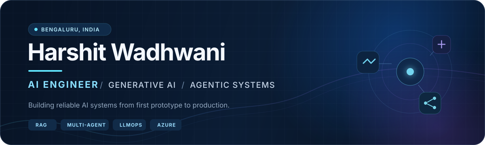

  

  
  
  

## Hello 👋

I'm **Harshit**, an AI Engineer at **GSK** working at the intersection of generative AI, platform engineering, and enterprise delivery. I build production-grade RAG applications, multi-agent systems, and reusable LLM tooling that make complex, regulated workflows simpler and faster.

My sweet spot is the full journey: understanding the problem, shaping the architecture, building the AI and application layers, and shipping with evaluation, observability, security, and CI/CD in place.

## What I work on

- **Agentic AI:** orchestration, memory, tool use, guardrails, and human feedback with LangGraph and LangChain
- **Retrieval systems:** vector and graph RAG, document intelligence, knowledge graphs, reranking, and evaluation
- **AI platforms:** reusable Python libraries, FastAPI services, data pipelines, CI/CD, tracing, and cost monitoring
- **Responsible delivery:** secure cloud architecture, access control, redaction, quality monitoring, and GxP-aware engineering

## Selected open-source work

| Project | What it does | Built with |
| :--- | :--- | :--- |
| **[LangHost](https://github.com/langhost/langhost)** | Open-source, self-hosted LangGraph Agent Server with production Postgres and Redis | Python · LangGraph · Docker |
| **[GitVideo](https://github.com/harshit-wadhwani/GitVideo)** | Turns a GitHub repository into a polished AI-generated showcase video | Python · Generative AI |
| **[OCR Compare](https://github.com/harshit-wadhwani/ocr_compare)** | Compares PDF-to-Markdown OCR pipelines for context-engineering workflows | Python · Streamlit · OCR |
| **[Gemini Data Extractor](https://github.com/harshit-wadhwani/gemini-data-extractor)** | Extracts structured document data against a user-defined schema | Python · Gemini · Streamlit |

## Toolbox

  
  
  
  
  
  
  
  
  
  

## A little more about me

- 🏆 Winner of the **GSK × Databricks Hackathon 2025**
- 🎓 Pursuing an **MSc in Artificial Intelligence** at the University of Leeds
- 🌱 Exploring better evaluation, context engineering, and reliable agent architectures
- 🤝 Always happy to talk about applied AI, open source, or an interesting problem

  Build useful things. Measure what matters. Keep learning.

